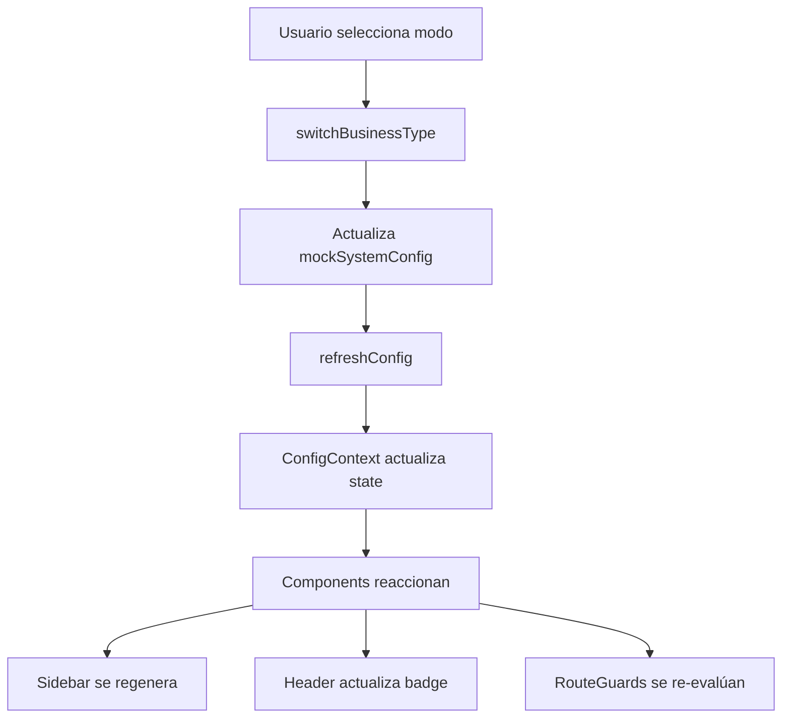

# 🎯 ODIN POS - Business Mode Switch - Guía Completa

## ✅ Sistema Implementado

ODIN POS ahora cuenta con un **sistema completo de modos de negocio** que permite adaptar dinámicamente la interfaz según el tipo de negocio configurado.

---

## 📋 Características Implementadas

### 1. ✅ **Tipos de Negocio Soportados**

El sistema soporta 3 modos principales (+ 8 adicionales):

#### **Modos Principales:**

- 🍽️ **Restaurante / Bar** (`restaurant`)
  - Mesas, Cocina, Delivery
  - Órdenes, Inventario, Proveedores
  
- 💅 **Spa / Salón / Uñas** (`spa`)
  - Citas/Agenda, Servicios
  - Clientes, Productos, Facturación
  
- 🔧 **Ferretería** (`hardware`)
  - Inventario, Compras, Proveedores
  - Ventas, Productos, Reportes

#### **Modos Adicionales:**

- 🏪 **Tienda Minorista** (`retail`)
- 🛠️ **Servicio Técnico** (`tech_service`)
- ☕ **Cafetería** (`cafe`)
- 🍔 **Comida Rápida** (`fast_food`)
- 🏭 **Mayorista** (`wholesale`)

### 2. ✅ **Sidebar Dinámico**

El menú lateral se adapta automáticamente según el modo de negocio:

```typescript
// Ejemplo: Modo Restaurante
- Dashboard
- Ventas
- Mesas ⭐
- Cocina ⭐
- Delivery ⭐
- Inventario
- ...

// Ejemplo: Modo Spa
- Dashboard
- Citas / Agenda ⭐
- Clientes
- Servicios ⭐
- Productos
- Caja / POS
- ...
```

### 3. ✅ **Badge de Modo en Header**

El header muestra visualmente el modo de negocio actual con un badge coloreado:

```
🏪 Modo: Ferretería
```

### 4. ✅ **Panel de Desarrollo**

Un panel flotante (solo visible en desarrollo) permite cambiar el modo en tiempo real:

- Click en el botón ⚙️ en la esquina inferior derecha
- Selecciona un tipo de negocio
- La UI se reconfigura automáticamente

### 5. ✅ **Route Guard (Protección de Rutas)**

Sistema de protección que:
- Bloquea acceso a módulos no habilitados
- Muestra mensaje elegante de "Módulo No Disponible"
- Permite volver al Dashboard o ir atrás

### 6. ✅ **Arquitectura Centralizada**

Todo configurado en archivos centrales:

```
/src/app/
├── types/config.types.ts          # Tipos y enums
├── services/configService.ts      # Configuraciones por modo
├── contexts/ConfigContext.tsx     # Estado global
└── components/
    ├── AdminSidebar.tsx          # Sidebar dinámico
    ├── AdminHeader.tsx           # Header con badge
    ├── DevPanel.tsx              # Panel de desarrollo
    └── RouteGuard.tsx            # Protección de rutas
```

---

## 🚀 Cómo Usar

### **1. Cambiar Tipo de Negocio (Desarrollo)**

```typescript
// Opción A: Usar el DevPanel
// 1. Click en botón ⚙️ (esquina inferior derecha)
// 2. Seleccionar tipo de negocio
// 3. La UI se actualiza automáticamente

// Opción B: Programáticamente
import { switchBusinessType } from '@/app/services/configService';
import { BusinessType } from '@/app/types/config.types';

await switchBusinessType(BusinessType.SPA);
await refreshConfig(); // Refresca la configuración
```

### **2. Verificar si un Módulo está Habilitado**

```typescript
import { useModule } from '@/app/hooks/useConfig';
import { SystemModule } from '@/app/types/config.types';

function MyComponent() {
  const hasTables = useModule(SystemModule.TABLES);
  
  return (
    <div>
      {hasTables && <TablesSection />}
    </div>
  );
}
```

### **3. Proteger una Ruta Completa**

```typescript
import { RouteGuard } from '@/app/components/RouteGuard';
import { SystemModule } from '@/app/types/config.types';

export default function MesasPage() {
  return (
    <RouteGuard requiredModule={SystemModule.TABLES}>
      <div>
        {/* Contenido de la página de mesas */}
      </div>
    </RouteGuard>
  );
}
```

### **4. Usar HOC para Proteger Páginas**

```typescript
import { withRouteGuard } from '@/app/components/RouteGuard';
import { SystemModule } from '@/app/types/config.types';

function MesasPage() {
  return <div>Contenido de mesas</div>;
}

export default withRouteGuard(
  MesasPage, 
  SystemModule.TABLES,
  'manage_tables' // Permiso opcional
);
```

### **5. Acceder a la Configuración Global**

```typescript
import { useConfig } from '@/app/hooks/useConfig';

function MyComponent() {
  const { config, loading, error } = useConfig();
  
  if (loading) return <Skeleton />;
  if (error) return <Error message={error} />;
  
  return (
    <div>
      <h1>{config.companyName}</h1>
      <p>Tipo: {config.businessType}</p>
      <p>Plan: {config.license.plan}</p>
      <p>Módulos activos: {config.enabledModules.length}</p>
    </div>
  );
}
```

---

## 📊 Mapa de Módulos por Modo

### 🍽️ **RESTAURANT (Restaurante / Bar)**

| Módulo | Habilitado | Ruta |
|--------|-----------|------|
| Dashboard | ✅ | `/admin/dashboard` |
| Ventas | ✅ | `/admin/ventas` |
| **Mesas** | ✅ | `/admin/mesas` |
| **Cocina** | ✅ | `/admin/cocina` |
| **Delivery** | ✅ | `/admin/delivery` |
| Inventario | ✅ | `/admin/inventario` |
| Proveedores | ✅ | `/admin/proveedores` |
| Órdenes de compra | ✅ | `/admin/ordenes` |
| Caja | ✅ | `/admin/caja` |
| Impresoras | ✅ | `/admin/impresoras` |
| Clientes | ✅ | `/admin/clientes` |
| Empleados | ✅ | `/admin/empleados` |
| Reportes | ✅ | `/admin/reportes` |
| Configuración | ✅ | `/admin/configuracion` |

**NO incluye:** N/A (tiene todos los módulos de restaurante)

---

### 💅 **SPA (Spa / Salón / Uñas)**

| Módulo | Habilitado | Ruta |
|--------|-----------|------|
| Dashboard | ✅ | `/admin/dashboard` |
| **Citas / Agenda** | ✅ | `/admin/citas` |
| Clientes | ✅ | `/admin/clientes` |
| **Servicios** | ✅ | `/admin/servicios` |
| Productos | ✅ | `/admin/productos` |
| Caja / POS | ✅ | `/admin/caja` |
| Facturación / Ventas | ✅ | `/admin/ventas` |
| Empleados / Técnicos | ✅ | `/admin/empleados` |
| Reportes | ✅ | `/admin/reportes` |
| Configuración | ✅ | `/admin/configuracion` |

**NO incluye:**
- ❌ Mesas
- ❌ Cocina
- ❌ Delivery
- ❌ Proveedores
- ❌ Órdenes de compra

---

### 🔧 **HARDWARE (Ferretería)**

| Módulo | Habilitado | Ruta |
|--------|-----------|------|
| Dashboard | ✅ | `/admin/dashboard` |
| Ventas / POS | ✅ | `/admin/ventas` |
| Productos | ✅ | `/admin/productos` |
| **Inventario** | ✅ | `/admin/inventario` |
| **Proveedores / Compras** | ✅ | `/admin/proveedores` |
| **Órdenes de compra** | ✅ | `/admin/ordenes` |
| Caja registradora | ✅ | `/admin/caja` |
| Clientes | ✅ | `/admin/clientes` |
| Reportes | ✅ | `/admin/reportes` |
| Configuración | ✅ | `/admin/configuracion` |

**NO incluye:**
- ❌ Mesas
- ❌ Cocina
- ❌ Agenda/Citas
- ❌ Delivery

---

## 🎨 Personalización

### **Agregar un Nuevo Tipo de Negocio**

**1. Actualizar el enum:**

```typescript
// /src/app/types/config.types.ts
export enum BusinessType {
  // ... existentes
  MY_BUSINESS = 'my_business',
}
```

**2. Crear configuración de módulos:**

```typescript
// /src/app/services/configService.ts
const getMyBusinessModules = (): ModuleConfig[] => [
  {
    id: SystemModule.DASHBOARD,
    enabled: true,
    label: 'Dashboard',
    icon: 'LayoutDashboard',
    route: '/admin/dashboard',
    order: 1,
  },
  // ... más módulos
];
```

**3. Agregar al switch:**

```typescript
export function getModulesByBusinessType(businessType: BusinessType): ModuleConfig[] {
  switch (businessType) {
    // ... existentes
    case BusinessType.MY_BUSINESS:
      return getMyBusinessModules();
    // ...
  }
}
```

**4. Actualizar DevPanel:**

```typescript
// /src/app/components/DevPanel.tsx
const businessTypes: BusinessTypeOption[] = [
  // ... existentes
  {
    type: BusinessType.MY_BUSINESS,
    label: 'Mi Negocio',
    description: 'Descripción del negocio',
    icon: MyIcon,
    color: 'from-blue-500 to-green-500',
  },
];
```

### **Agregar un Nuevo Módulo**

**1. Definir en enum:**

```typescript
// /src/app/types/config.types.ts
export enum SystemModule {
  // ... existentes
  MY_MODULE = 'my_module',
}
```

**2. Agregar a la configuración del modo:**

```typescript
{
  id: SystemModule.MY_MODULE,
  enabled: true,
  label: 'Mi Módulo',
  icon: 'Star', // Icono de lucide-react
  route: '/admin/mi-modulo',
  order: 99,
}
```

**3. Crear la página:**

```typescript
// /src/app/(admin)/mi-modulo/page.tsx
import { RouteGuard } from '@/app/components/RouteGuard';
import { SystemModule } from '@/app/types/config.types';

export default function MiModuloPage() {
  return (
    <RouteGuard requiredModule={SystemModule.MY_MODULE}>
      <div>
        <h1>Mi Nuevo Módulo</h1>
      </div>
    </RouteGuard>
  );
}
```

---

## 🔐 Sistema de Permisos

Los permisos se verifican con `usePermission()`:

```typescript
import { usePermission } from '@/app/hooks/useConfig';

function EditButton() {
  const canEdit = usePermission('manage_products');
  
  if (!canEdit) return null;
  
  return <button>Editar Producto</button>;
}
```

**Permisos disponibles:**
```
'view_dashboard'
'manage_sales'
'manage_inventory'
'manage_employees'
'manage_customers'
'manage_suppliers'
'manage_orders'
'view_reports'
'manage_settings'
'manage_cash_register'
'manage_printers'
'manage_tables'
'manage_kitchen'
'manage_delivery'
```

---

## 🔄 Flujo de Datos



---

## 📦 Integración con Backend

Cuando el backend esté listo, solo necesitas modificar:

### `/src/app/services/configService.ts`

```typescript
export async function getSystemConfig(): Promise<ConfigApiResponse> {
  // ANTES (mock):
  // return { success: true, data: mockSystemConfig, ... };
  
  // DESPUÉS (real):
  const response = await fetch('/api/config/system', {
    headers: {
      'Authorization': `Bearer ${getToken()}`,
    },
  });
  
  const data = await response.json();
  return data;
}
```

El frontend **NO necesita cambios** en componentes, solo en el servicio.

---

## ⚠️ Restricciones y Buenas Prácticas

### ✅ **Hacer:**

- Usar `useModule()` para verificar módulos
- Usar `usePermission()` para verificar permisos
- Envolver páginas con `<RouteGuard>`
- Centralizar configuraciones en `configService.ts`
- Usar los helpers de configuración

### ❌ **NO Hacer:**

- ❌ NO usar `if (mode === 'spa')` en componentes
- ❌ NO duplicar pantallas por modo sin necesidad
- ❌ NO hardcodear módulos en múltiples archivos
- ❌ NO validar lógica de negocio en frontend
- ❌ NO asumir que un módulo existe sin verificar

---

## 🧪 Testing

### **Cambiar modo en desarrollo:**

1. Ir a cualquier página de admin
2. Click en botón ⚙️ (esquina inferior derecha)
3. Seleccionar un modo de negocio
4. Observar cómo cambia el sidebar
5. Intentar acceder a módulos bloqueados

### **Probar Route Guard:**

1. Cambiar a modo "Spa"
2. Intentar acceder a `/admin/mesas`
3. Debe mostrar "Módulo No Disponible"
4. Click en "Ir al Dashboard"

---

## 📝 Notas Importantes

✅ El frontend es **"tonto"**: solo renderiza según configuración
✅ Toda la lógica de negocio está en el **backend**
✅ Los módulos se habilitan/deshabilitan **dinámicamente**
✅ El sistema es **escalable** y **mantenible**
✅ Preparado para **modo SaaS multi-empresa**

---

## 🎉 Resultado Final

Un sistema **completamente modular** donde:

- ✅ La misma base de código sirve para **múltiples industrias**
- ✅ Los módulos se **habilitan/deshabilitan** dinámicamente
- ✅ La UI se **adapta automáticamente** al tipo de negocio
- ✅ El sistema es **escalable** y **mantenible**
- ✅ Preparado para **SaaS multi-empresa**
- ✅ **Sin duplicación de código**
- ✅ **Fácil de extender**

---

**Desarrollado con ❤️ para ODIN POS**
