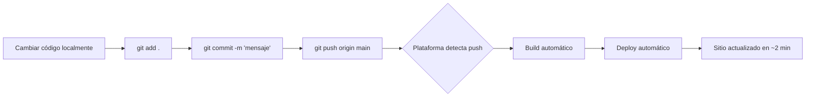

# 🐙 Deploy ODIN POS desde GitHub

Esta guía te ayuda a deployar ODIN POS directamente desde tu repositorio de GitHub usando diferentes plataformas.

---

## 🎯 Prerequisitos

- ✅ Código ya subido a GitHub
- ✅ Cuenta en la plataforma de deployment (gratis)
- ✅ 5 minutos de tiempo

---

## 🟢 Opción 1: Vercel (Recomendado)

### Ventajas:
- ✅ Deploy en 2 minutos
- ✅ Auto-deploy en cada push
- ✅ Preview deployments automáticos en PRs
- ✅ SSL gratis
- ✅ CDN global
- ✅ 100GB bandwidth/mes gratis

### Pasos:

**1. Ve a Vercel**
```
https://vercel.com/signup
```

**2. Crea cuenta con GitHub**
- Click en "Continue with GitHub"
- Autoriza Vercel

**3. Importa el proyecto**
- Click en "Add New Project"
- Busca tu repositorio "odin-pos"
- Click "Import"

**4. Configura el proyecto**
```yaml
Framework Preset: Vite
Root Directory: ./
Build Command: pnpm build
Output Directory: dist
Install Command: pnpm install
Node.js Version: 18.x
```

**5. Deploy**
- Click "Deploy"
- Espera ~2 minutos
- ¡Listo! Tu sitio está en línea

**URL de tu sitio:**
```
https://odin-pos-tu-usuario.vercel.app
```

### 📝 Configuración Post-Deploy

**Variables de entorno (opcional):**
1. Ve a tu proyecto en Vercel
2. Settings → Environment Variables
3. Agrega variables si las necesitas:
   ```
   VITE_API_URL=https://api.example.com
   ```

**Dominio personalizado (opcional):**
1. Settings → Domains
2. Add → Escribe tu dominio
3. Sigue las instrucciones para configurar DNS

### 🔄 Auto-Deploy

Cada vez que hagas push a `main`, Vercel deployará automáticamente:

```bash
git add .
git commit -m "Nueva funcionalidad"
git push origin main

# Vercel detecta el push y deploya automáticamente
```

---

## 🔵 Opción 2: Netlify

### Ventajas:
- ✅ Interfaz muy amigable
- ✅ Drag & drop también disponible
- ✅ Forms integrados
- ✅ Functions serverless
- ✅ SSL gratis

### Pasos:

**1. Ve a Netlify**
```
https://app.netlify.com/signup
```

**2. Crea cuenta con GitHub**
- Click en "Sign up with GitHub"
- Autoriza Netlify

**3. Importa el proyecto**
- Click "Add new site"
- "Import an existing project"
- "Deploy with GitHub"
- Selecciona tu repositorio

**4. Configura el build**
```yaml
Branch to deploy: main
Build command: pnpm build
Publish directory: dist
```

**5. Deploy**
- Click "Deploy site"
- Espera ~2 minutos
- ¡Listo!

**URL de tu sitio:**
```
https://random-name-123456.netlify.app
```

### 📝 Cambiar el nombre del sitio

1. Site settings → General → Site details
2. Click "Change site name"
3. Escribe: `odin-pos-tuempresa`
4. Nueva URL: `https://odin-pos-tuempresa.netlify.app`

---

## 🟠 Opción 3: GitHub Pages

### Ventajas:
- ✅ Completamente gratis (ilimitado)
- ✅ Integración perfecta con GitHub
- ✅ Ideal para proyectos open source
- ✅ SSL gratis con dominio de GitHub

### Pasos:

**1. Crear workflow de GitHub Actions**

Crea el archivo `.github/workflows/deploy.yml`:

```yaml
name: Deploy to GitHub Pages

on:
  push:
    branches:
      - main

permissions:
  contents: read
  pages: write
  id-token: write

jobs:
  build:
    runs-on: ubuntu-latest
    steps:
      - name: Checkout
        uses: actions/checkout@v4

      - name: Setup Node
        uses: actions/setup-node@v4
        with:
          node-version: '18'

      - name: Setup pnpm
        uses: pnpm/action-setup@v2
        with:
          version: 8

      - name: Install dependencies
        run: pnpm install

      - name: Build
        run: pnpm build

      - name: Upload artifact
        uses: actions/upload-pages-artifact@v3
        with:
          path: ./dist

  deploy:
    environment:
      name: github-pages
      url: ${{ steps.deployment.outputs.page_url }}
    runs-on: ubuntu-latest
    needs: build
    steps:
      - name: Deploy to GitHub Pages
        id: deployment
        uses: actions/deploy-pages@v4
```

**2. Actualizar vite.config.ts**

Agrega la configuración de `base`:

```typescript
export default defineConfig({
  // ... configuración existente
  base: '/odin-pos/', // ⬅️ Reemplaza con el nombre de tu repo
})
```

**3. Commit y push**

```bash
git add .
git commit -m "Setup GitHub Pages deployment"
git push origin main
```

**4. Configurar GitHub Pages**

1. Ve a tu repositorio en GitHub
2. Settings → Pages
3. Source: **GitHub Actions** (no "Deploy from branch")
4. Save

**5. Esperar el workflow**

- Ve a la pestaña "Actions"
- Verás el workflow ejecutándose
- Espera ~3 minutos

**URL de tu sitio:**
```
https://tu-usuario.github.io/odin-pos/
```

### ⚠️ Importante para GitHub Pages

Si tu repositorio se llama diferente, actualiza el `base` en `vite.config.ts`:

```typescript
// Si tu repo es "mi-pos-system"
base: '/mi-pos-system/'

// Si tu repo es "tu-usuario.github.io" (repo especial)
base: '/'
```

---

## 🔴 Opción 4: Render

### Ventajas:
- ✅ Backend gratuito incluido
- ✅ Bases de datos PostgreSQL gratis
- ✅ Ideal si planeas agregar API
- ✅ SSL gratis

### Pasos:

**1. Ve a Render**
```
https://render.com/
```

**2. Crea cuenta con GitHub**
- Sign Up with GitHub
- Autoriza Render

**3. Crear Static Site**
- Click "New +"
- "Static Site"
- Conecta tu repositorio

**4. Configura el build**
```yaml
Name: odin-pos
Branch: main
Build Command: pnpm install && pnpm build
Publish Directory: dist
```

**5. Deploy**
- Click "Create Static Site"
- Espera ~3 minutos
- ¡Listo!

**URL de tu sitio:**
```
https://odin-pos.onrender.com
```

---

## 🟣 Opción 5: Railway

### Ventajas:
- ✅ Deploy desde Dockerfile
- ✅ Ideal para microservicios
- ✅ $5 crédito gratis/mes
- ✅ Fácil escalar

### Pasos:

**1. Crear Dockerfile**

Crea el archivo `Dockerfile` en la raíz:

```dockerfile
FROM node:18-alpine AS builder
WORKDIR /app
RUN npm install -g pnpm
COPY package.json pnpm-lock.yaml ./
RUN pnpm install --frozen-lockfile
COPY . .
RUN pnpm build

FROM nginx:alpine
COPY --from=builder /app/dist /usr/share/nginx/html
RUN echo 'server { listen 80; location / { root /usr/share/nginx/html; try_files $uri $uri/ /index.html; } }' > /etc/nginx/conf.d/default.conf
EXPOSE 80
CMD ["nginx", "-g", "daemon off;"]
```

**2. Commit y push**

```bash
git add Dockerfile
git commit -m "Add Dockerfile for Railway"
git push origin main
```

**3. Ve a Railway**
```
https://railway.app/
```

**4. Deploy**
- Login with GitHub
- New Project
- Deploy from GitHub repo
- Selecciona tu repo
- Railway detecta el Dockerfile automáticamente
- Deploy

**URL de tu sitio:**
```
https://odin-pos-production.up.railway.app
```

---

## 📊 Comparativa Rápida

| Plataforma | Tiempo Setup | Auto-Deploy | Preview en PRs | Gratis |
|------------|-------------|-------------|----------------|---------|
| **Vercel** | 2 min | ✅ | ✅ | ✅ 100% |
| **Netlify** | 3 min | ✅ | ✅ | ✅ 100% |
| **GitHub Pages** | 5 min | ✅ | ❌ | ✅ 100% |
| **Render** | 4 min | ✅ | ❌ | ✅* Limited |
| **Railway** | 5 min | ✅ | ❌ | ✅* $5/mes |

---

## 🔄 Workflows de Auto-Deploy

Todas las plataformas soportan auto-deploy. Aquí está el flujo típico:



### Ejemplo de workflow:

```bash
# 1. Hacer cambios
# Editas archivos...

# 2. Commit
git add .
git commit -m "Feature: Agregar reporte de ventas por hora"

# 3. Push
git push origin main

# 4. La plataforma deploya automáticamente
# Recibirás un email cuando termine

# 5. Verifica tu sitio
# URL: https://tu-sitio.vercel.app
```

---

## 🌿 Deploy con Branches

### Estrategia recomendada:

```
main → Producción (auto-deploy)
develop → Preview (auto-deploy a URL preview)
feature/* → Preview en PRs
```

### Configurar en Vercel:

1. Settings → Git
2. Production Branch: `main`
3. ✅ Automatic Deployments for all branches

Ahora cada branch tendrá su propia URL:
```
main → https://odin-pos.vercel.app
develop → https://odin-pos-git-develop.vercel.app
feature/new-report → https://odin-pos-git-feature-new-report.vercel.app
```

---

## 🐛 Troubleshooting Común

### Error: "Build failed - pnpm not found"

**Solución en Vercel/Netlify:**
1. Project Settings → Build & Development Settings
2. Package Manager: **pnpm**
3. Re-deploy

**Solución alternativa:**
Cambia el build command a:
```bash
npm install -g pnpm && pnpm install && pnpm build
```

### Error: "404 on page reload"

**Causa:** Falta configuración SPA.

**Solución:**
Los archivos `vercel.json` y `netlify.toml` ya están incluidos en el proyecto. Solo asegúrate de que estén en el repositorio:

```bash
git add vercel.json netlify.toml
git commit -m "Add platform configs"
git push
```

### Error: "Module Cocina crashes"

Ya está corregido en el código. Si persiste:

```bash
# 1. Pull los últimos cambios
git pull origin main

# 2. Re-deploy
# La plataforma detectará los cambios automáticamente
```

---

## 📈 Después del Deployment

### 1. Configurar Dominio Personalizado

**En Vercel:**
- Settings → Domains → Add
- Ingresa: `pos.tuempresa.com`
- Configura CNAME en tu DNS:
  ```
  Type: CNAME
  Name: pos
  Value: cname.vercel-dns.com
  ```

**En Netlify:**
- Domain settings → Add custom domain
- Sigue las instrucciones

### 2. Monitorear Performance

**Vercel Analytics:**
- Settings → Analytics → Enable
- Gratis para hobby projects

**Google Analytics (opcional):**
Agrega a `/index.html` (si existe) o crea un componente Analytics.

### 3. Configurar Notificaciones

**En Vercel:**
- Settings → Notifications
- ✅ Email on deployment success/failure
- Integración con Slack (opcional)

### 4. Branch Protection (Recomendado)

En GitHub:
1. Settings → Branches
2. Add rule para `main`
3. ✅ Require pull request reviews
4. ✅ Require status checks to pass (Vercel build)

---

## ✅ Checklist de Deployment Exitoso

- [ ] Sitio carga correctamente en la URL
- [ ] Login funciona
- [ ] Dashboard se muestra
- [ ] Módulo Cocina funciona (⚠️ crítico)
- [ ] Reportes cargan
- [ ] No hay errores en consola (F12)
- [ ] SPA routing funciona (recarga la página)
- [ ] localStorage guarda datos
- [ ] Auto-deploy funciona (hacer un push de prueba)

---

## 🎓 Best Practices

1. ✅ **Usa branches** para features
2. ✅ **Crea PRs** antes de mergear a main
3. ✅ **Testea en preview URLs** antes de production
4. ✅ **Configura notificaciones** de deployment
5. ✅ **Usa dominio personalizado** para producción
6. ✅ **Monitorea analytics** para detectar problemas

---

## 🆘 ¿Necesitas Ayuda?

1. **Logs de build:** Revisa en la plataforma
2. **Errores de runtime:** Abre DevTools (F12) en tu sitio
3. **Configuración:** Verifica `vercel.json` o `netlify.toml`
4. **Troubleshooting completo:** Ver [DEPLOYMENT_GUIDE.md](./DEPLOYMENT_GUIDE.md)

---

## 📚 Documentación Adicional

- [QUICK_START_DEPLOYMENT.md](./QUICK_START_DEPLOYMENT.md) - Inicio rápido
- [DEPLOYMENT_GUIDE.md](./DEPLOYMENT_GUIDE.md) - Guía completa
- [DEPLOYMENT_COMMANDS.md](./DEPLOYMENT_COMMANDS.md) - Comandos útiles
- [DEPLOYMENT_INDEX.md](./DEPLOYMENT_INDEX.md) - Índice de todas las guías

---

**¡Tu proyecto está listo para deployarse desde GitHub en menos de 5 minutos!** 🚀

**Recomendación final:** Usa **Vercel** para la mejor experiencia.
